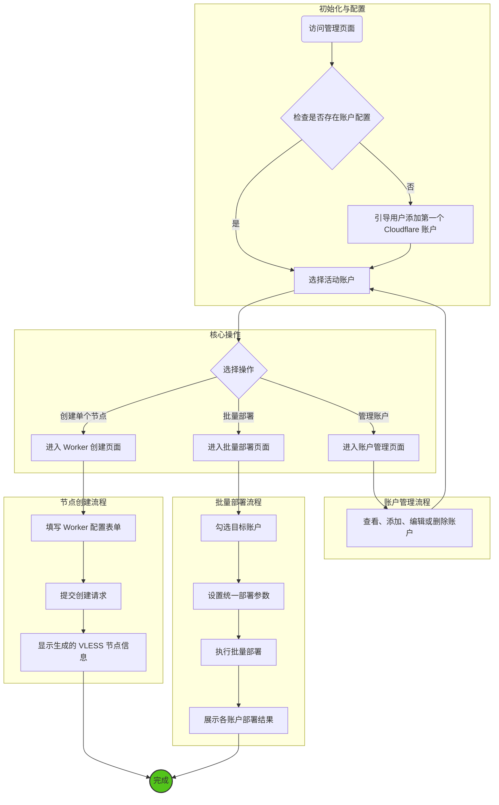

# EDtunnel - 基于 Next.js 和 shadcn/ui 的 VLESS 节点管理工具技术文档

## 1. 项目概述

### 1.1 项目简介

EDtunnel 是一个基于 **Next.js**、**TypeScript** 和 **shadcn/ui** 构建的现代化 Web 应用，旨在为用户提供一个直观、高效的界面，用于管理和部署 Cloudflare Workers 上的 VLESS 节点。通过利用 Next.js 的服务器端渲染 (SSR) 和增量静态再生 (ISR) 功能，应用在保证动态数据实时性的同时，提供了卓越的性能和用户体验。它解决了手动配置 Worker 的复杂性，支持单个节点创建和多账户批量部署，极大地提升了网络代理节点的搭建效率。

### 1.2 目标用户

*   需要快速搭建和管理个人代理节点的开发者和技术爱好者。
*   希望为多个 Cloudflare 账户统一管理和部署网络资源的用户。

### 1.3 主要功能

*   **Landing 页面:** 提供一个美观、静态生成的首页，介绍项目特性。
*   **多账户管理:** 安全地添加、编辑、切换和删除多个 Cloudflare 账户。
*   **VLESS 节点创建:** 提供一个包含多种自定义参数（如 UUID、代理 IP、SOCKS5 中继等）的表单，用于创建单个 Worker 节点。
*   **批量部署:** 支持将 Worker 节点一键部署到多个选定的 Cloudflare 账户。
*   **配置管理:** 支持导入和导出应用的全部配置（包括账户信息和表单设置），方便备份和迁移。
*   **安全存储:** 用户账户凭证（API Key）通过浏览器 IndexedDB 进行加密存储，确保本地数据安全。
*   **国际化:** 支持中英文双语切换。
*   **响应式设计:** 使用 Tailwind CSS 构建，完美适配桌面和移动设备。

## 2. 系统架构

### 2.1 架构图

```mermaid
graph TD
    subgraph "用户浏览器"
        A[Next.js 前端 (shadcn/ui)] --> B{Next.js API Route (/api/createWorker)};
    end

    subgraph "Vercel / Cloudflare Pages"
        B --> C[后端 API (cfworkerback-pages5.pages.dev)];
    end

    subgraph "Cloudflare API"
        C --> D[Cloudflare API];
    end

    A -- 本地存储 --> E[IndexedDB (加密存储)];
    F[外部 IP 服务] --> A;

    style A fill:#cce5ff,stroke:#333,stroke-width:2px
    style B fill:#ffe6cc,stroke:#333,stroke-width:2px
    style C fill:#d5e8d4,stroke:#333,stroke-width:2px
    style E fill:#f8cecc,stroke:#333,stroke-width:2px
```

### 2.2 架构解析

#### 2.2.1 前端 (Frontend)

*   **框架与语言:** 使用 `Next.js` (App Router) 和 `TypeScript` 构建。利用 React Server Components (RSC) 渲染静态内容，Client Components 处理交互逻辑，实现了性能和交互性的最佳平衡。
*   **UI 组件库:** `shadcn/ui` 结合 `Tailwind CSS`，提供了一套高度可定制、美观且符合现代设计标准的 UI 组件。
*   **页面渲染策略:**
    *   **Landing Page:** 采用静态站点生成 (SSG) 或增量静态再生 (ISR)，实现极速加载。
    *   **管理后台:** 采用服务器端渲染 (SSR) 或客户端渲染 (CSR)，确保动态数据的实时性。
*   **状态管理:**
    *   `AccountContext`: 在客户端组件中负责管理用户的 Cloudflare 账户信息。
    *   `ThemeContext`: 管理应用的主题（明亮/暗黑模式）。
*   **API 通信:** `axios` 或 `fetch` 被封装在客户端服务中，通过请求拦截器自动为发往 Cloudflare API 的请求注入当前选定账户的认证凭据。
*   **本地存储:** 用户的敏感信息（如 Global API Key）通过 `EncryptedStorage` 服务（`storage.ts`）使用 `AES-GCM` 算法加密后存储在浏览器的 `IndexedDB` 中，确保了客户端数据的安全性。

#### 2.2.2 代理层 (Proxy Layer)

为了解决浏览器端直接请求后端 API 的跨域（CORS）问题，项目利用 **Next.js API Routes** 作为代理层。

*   位于 `app/api/createWorker/route.ts` 的 API 路由会拦截所有 `/api/createWorker` 的请求。
*   该路由将请求原封不动地转发给真实的后端 API (`https://cfworkerback-pages5.pages.dev`)。
*   这种设计统一了 API 调用路径，无需像 Vite 那样为开发和生产环境配置不同的代理规则。

#### 2.2.3 后端 (Backend)

*   后端服务地址保持不变：`https://cfworkerback-pages5.pages.dev`。
*   它负责接收来自动作的请求，解析参数，并调用 Cloudflare 的官方 API 来执行创建和部署 Worker 的操作。

## 3. 用户流程图

```mermaid
graph TD
    Start --> A{访问 Landing 页面};
    A --> B{进入管理后台};
    B --> C{添加 Cloudflare 账户};
    C --> D{在账户管理中输入<br>名称、邮箱、API Key};
    D --> E{选择一个账户作为当前活动账户};
    E --> F{填写 Worker 创建表单};
    F --> G{配置 UUID、Worker 名称等参数};
    G --> H{点击 "创建 Worker 节点"};
    H --> I{前端发送请求到 /api/createWorker};
    I --> J{Next.js API Route 代理请求};
    J --> K{后端服务调用 Cloudflare API};
    K --> L{Cloudflare 创建 Worker};
    L --> M{返回 VLESS 节点信息};
    M --> N{前端显示节点地址和操作按钮};
    N --> O{用户复制地址或导入到客户端};
    O --> End;

    E --> P{选择批量部署};
    P --> Q{选择多个目标账户};
    Q --> R{配置 Worker 名称基准};
    R --> H;

    style Start fill:#52c41a,stroke:#333,stroke-width:2px
    style End fill:#52c41a,stroke:#333,stroke-width:2px
```

## 4. API 请求数据方式

### 4.1 创建 Worker (`/api/createWorker`)

API 端点、请求方法和数据结构保持不变，因为后端服务没有改变。改变的只是请求的代理方式。

*   **请求方法:** `POST`
*   **请求路径:** `/api/createWorker` (此路径由 Next.js API Route 处理并代理)
*   **请求体 (Body):**
    ```json
    {
      "email": "user@example.com",
      "globalAPIKey": "c2547eb745079dac9320b638f5e225cf483cc5cfdda41",
      "workerName": "my-awesome-worker",
      "uuid": "d342d11e-d424-4583-b36e-524ab1f0afa4",
      "nodeName": "MyNode",
      "proxyIp": "1.1.1.1:8443,cdn.example.com",
      "socks5Proxy": "user:pass@host:port",
      "socks5Relay": false,
      "customDomain": "worker.mydomain.com"
    }
    ```
*   **成功/失败响应:** 与原版一致。

## 5. 开发与部署

### 5.1 环境设置

1.  **创建 Next.js 项目:**
    ```bash
    npx create-next-app@latest cfworker --typescript --tailwind --eslint
    cd cfworker
    ```
2.  **初始化 shadcn/ui:**
    ```bash
    npx shadcn-ui@latest init
    ```
    根据提示配置 `tailwind.config.ts` 和 `globals.css`。
3.  **安装其他依赖:**
    ```bash
    npm install axios antd-style class-variance-authority clsx lucide-react tailwind-merge
    ```
4.  **配置环境变量:**
    创建一个 `.env.local` 文件，用于存放后端 API 地址等敏感信息。
    ```
    NEXT_PUBLIC_API_BASE_URL=https://cfworkerback-pages5.pages.dev
    ```

### 5.2 运行开发服务器

```bash
npm run dev
```
应用将在 `http://localhost:3000` 启动，并开启热重载。

### 5.3 构建与部署

1.  **构建项目:**
    ```bash
    npm run build
    ```
    此命令会优化并打包应用，输出到 `.next` 目录。

2.  **部署:**
    推荐将应用部署到 **Vercel** 或 **Cloudflare Pages**，这两个平台都对 Next.js 提供了原生支持和优化。

## 6. 总结

EDtunnel 项目通过升级到 Next.js 和 shadcn/ui 技术栈，不仅在 UI/UX 上实现了现代化，更在架构层面利用了 Next.js 的混合渲染能力，提升了应用的性能和可维护性。其核心优势在于保留了原有的多账户管理和批量部署功能，同时通过 Next.js API Routes 提供了更简洁的代理方案。本文档详细介绍了新架构下的各项功能、系统设计和开发流程，为后续的开发和维护提供了清晰的指引。
## 7. 前端管理后台设计

本部分详细描述了前端管理后台的页面设计和用户操作流程，旨在为开发者提供清晰的界面实现指南。

### 7.1 管理流程设计

管理后台的核心流程围绕着“账户管理”和“节点部署”两个主要任务。



### 7.2 页面内容规划

#### 7.2.1 主页面 / Worker 创建页面

作为应用的核心功能页面，它集成了账户选择和节点创建两大功能。

*   **页面布局:**
    *   **顶部导航栏:**
        *   项目 Logo 和标题。
        *   账户选择器下拉菜单：列出所有已添加的账户，并标记当前活动账户。提供“管理账户”的快捷入口。
        *   主题切换按钮（明亮/暗黑）。
        *   语言切换按钮（中/英）。
    *   **主内容区:**
        *   **Worker 创建表单:** 包含所有可配置的参数字段，如 `Worker 名称`、`UUID`、`代理 IP` 等。每个字段应有清晰的标签和提示信息。
        *   **操作按钮:** “创建 Worker 节点”和“批量部署”按钮。
    *   **输出区:**
        *   用于显示成功创建后的 VLESS 节点链接、二维码以及相关操作按钮（如“复制链接”）。
        *   显示错误或成功状态的通知消息。

#### 7.2.2 账户管理页面

通过弹窗（Modal）或独立页面的形式提供。

*   **页面内容:**
    *   **账户列表:**
        *   以表格或列表形式展示所有已添加的账户。
        *   每行显示账户名称和邮箱。
        *   提供“编辑”、“删除”和“设为活动账户”的操作按钮。
    *   **添加/编辑表单:**
        *   包含字段：账户名称（自定义）、Cloudflare 邮箱、Global API Key。
        *   表单校验：确保邮箱格式正确，API Key 不为空。
    *   **操作按钮:** “添加新账户”按钮，点击后弹出添加表单。

#### 7.2.3 批量部署页面

用于将同一个 Worker 配置部署到多个账户。

*   **页面内容:**
    *   **账户选择区:**
        *   以列表形式展示所有账户，并附带复选框，允许用户选择一个或多个目标账户。
    *   **部署配置区:**
        *   提供一个简化的表单，用于设置本次批量部署的通用参数，例如 `Worker 名称`（可以支持变量如 `{account_name}` 来动态生成）。
    *   **执行与状态区:**
        *   “开始批量部署”按钮。
        *   一个实时状态显示区域，逐行展示每个选定账户的部署进度（等待、部署中、成功、失败）和结果信息。

#### 7.2.4 配置管理

通常集成在设置或页脚部分。

*   **功能:**
    *   **导出配置:**
        *   一个“导出配置”按钮。
        *   点击后，将当前所有账户信息和表单设置序列化为 JSON 格式，并生成一个 `.json` 文件供用户下载。
    *   **导入配置:**
        *   一个“导入配置”按钮。
        *   点击后，弹出文件选择框，用户选择之前导出的 `.json` 文件。
        *   应用解析文件内容，并提示用户确认是否覆盖现有配置。
#### 7.2.5 Landing Page

作为应用的门户，Landing Page 旨在吸引用户并清晰地传达项目价值。

*   **页面布局:**
    *   **英雄区 (Hero Section):**
        *   醒目的标题，如“轻松管理您的 Cloudflare VLESS 节点”。
        *   简短的副标题，概括核心功能。
        *   一个显著的“进入管理后台”按钮 (Call to Action)。
        *   一张展示应用界面的截图或动态图。
    *   **特性介绍区:**
        *   使用卡片或图标列表形式，展示核心功能，如“多账户管理”、“一键批量部署”、“安全加密存储”等。
    *   **技术栈展示:**
        *   展示项目使用的主要技术，如 Next.js, shadcn/ui, Cloudflare Workers 等。
    *   **页脚 (Footer):**
        *   包含项目 GitHub 链接、文档链接和开发者信息。